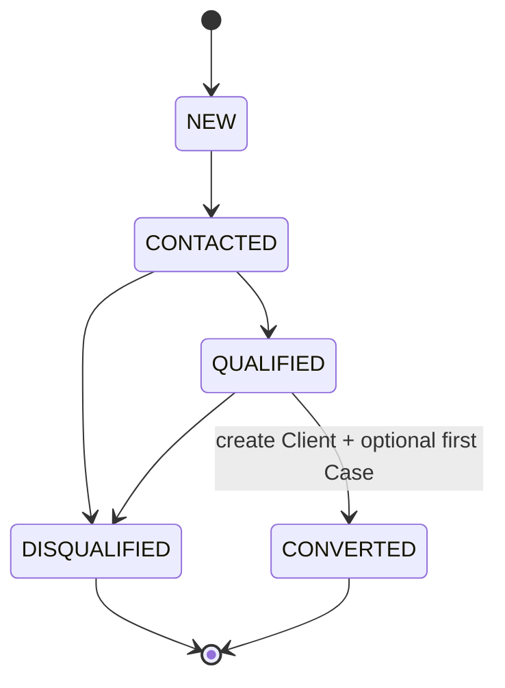
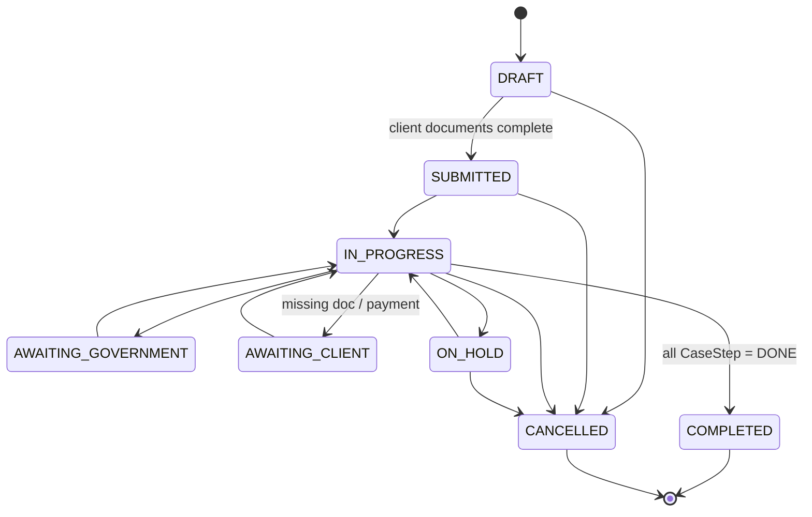
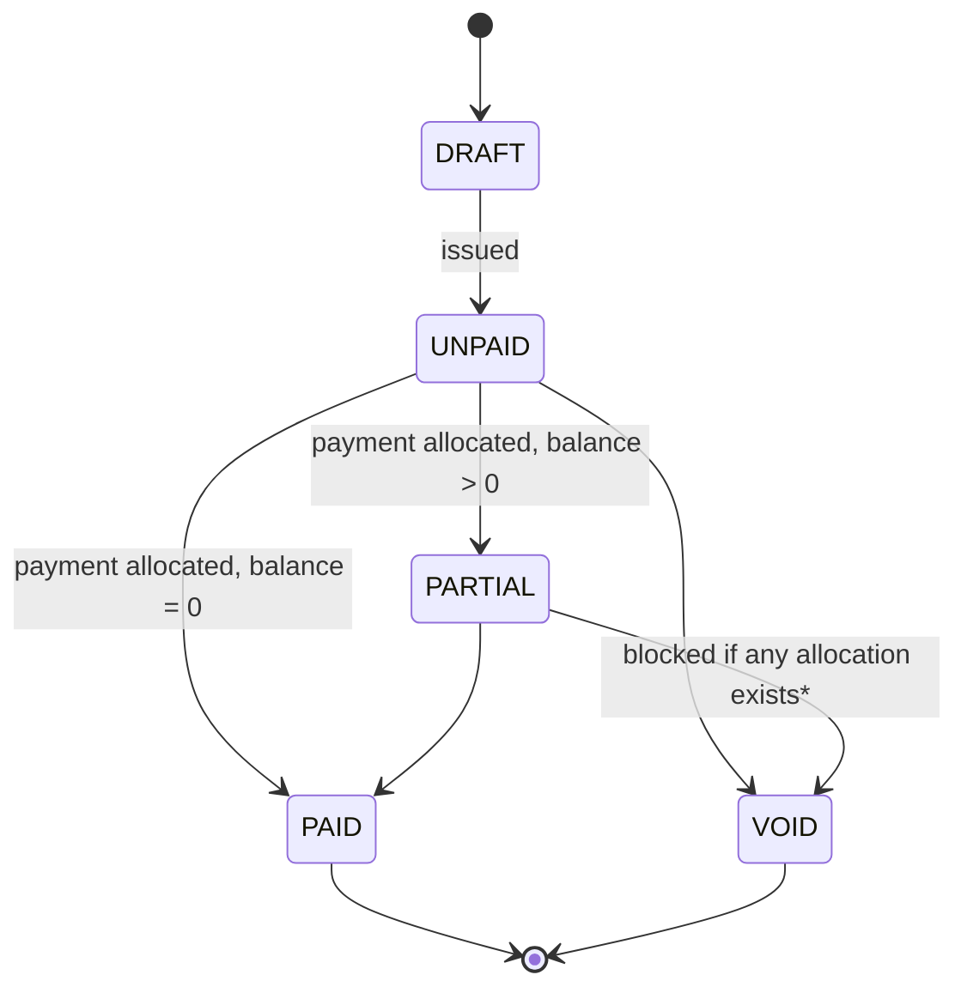
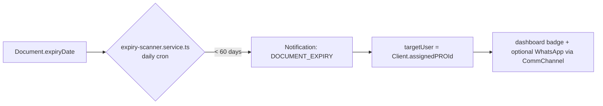

# Zyra CRM — Architecture Restructure Blueprint

**Niche:** Documents Clearance Services (UAE PRO / typing-center operations)
**Roles:** Admin, PRO Agent, Operations
**Stack (as it exists today):** Next.js 15 App Router, Prisma 6 ORM, PostgreSQL via Supabase, Supabase Auth (SSR cookies), server actions (`lib/actions/*`) over service modules (`lib/services/*`), RBAC via `lib/rbac.ts` + `lib/session.ts`.

This is not written against a generic CRM template. Every finding below is verified against your live `prisma/schema.prisma` and your production database (project `kzwkftmfrzqbxbywvcmd`, checked via Supabase MCP). Row counts are cited so you know exactly which changes are free (empty tables) and which need a real migration (populated tables).

---

## 0. Diagnosis — what's actually wrong, with evidence

Your stated pain points, mapped to the exact tables/lines causing them:

### 0.1 "Messy relational tables"
You have **two disconnected, unconnected case-tracking entities** for the same real-world concept (a client's government service case):

- `CaseFile` (`prisma/schema.prisma:466`) — `code`, `clientId`, `serviceType: String` (free text), `status: String`, `openedAt`/`closedAt`. **0 rows in production.**
- `Workflow` + `WorkflowStep` (`prisma/schema.prisma:233`) — `clientId`, `templateId → ServiceTemplate`, `category: String`, steps with gov reference numbers, assignees, due dates. **0 rows in production.**

No foreign key between them. `CaseFile.serviceType` duplicates `Workflow.category`. A case opened today could be tracked in either table depending on which code path touched it — that's the mess. Because both are empty, **this is a zero-data-risk unification**, the cheapest fix in this whole document.

### 0.2 "Bloated client profiles" — Lead and Client are the same table
`Client` (`prisma/schema.prisma:102`) carries `leadSource: String @default("OTHER")` and `accountStatus: String @default("PROSPECT")` directly on the client record. There is no separate `Lead` entity. Every cold inquiry becomes a full `Client` row with a KYC-shaped schema (`CorporateProfile`/`IndividualProfile`, TRN, credit limit, payment terms, assigned PRO, billing relations) sitting mostly null until the prospect actually converts. That's the bloat — the table is doing two jobs.

### 0.3 "Slow pipeline tracking" — you can't measure what you don't log
There is no stage-history table anywhere. `WorkflowStep.status` and `CaseFile.status` are mutated in place with no record of *when* a case entered a status or *who* moved it. You cannot currently answer "how long do cases sit in AWAITING_GOVERNMENT" because nothing timestamps the transition — only the current state survives. This is why pipeline tracking feels slow: there's no data to make it fast.

### 0.4 "Lack of audit logs"
`AuditLog` (`prisma/schema.prisma:591`) exists, and `lib/actions/audit.ts` was scaffolded this session — but it's not yet wired into the mutating paths (`finance.service.ts`, client updates, case/workflow changes call nothing from it yet). The model is there; the interception isn't.

### 0.5 "Chaotic invoice/billing state"
Already substantially fixed this session — the legacy generic `Transaction` + `Category` tables are gone, replaced with explicit `Invoice`/`Expense`/`Payment`/`PaymentAllocation` and a real double-entry `Account`/`JournalEntry`/`JournalLine` ledger. **Treat billing as largely done; this document extends it, not rewrites it.**

The one residual issue, and it's systemic across the *whole* schema, not just billing: **every status-shaped field is typed `String`, not a Postgres/Prisma `enum`.**

```
Client.accountStatus          String @default("PROSPECT")     schema.prisma:105
WorkflowStep.status           String @default("PENDING")      schema.prisma:261
Task.status                   String @default("PENDING")      schema.prisma:295
Document.verificationStatus   String @default("PENDING_REVIEW") schema.prisma:341
Quotation.status              String @default("DRAFT")        schema.prisma:372
Invoice.status                String @default("DRAFT")        schema.prisma:409
Expense.status                String @default("UNPAID")       schema.prisma:452
CaseFile.status                String @default("OPEN")         schema.prisma:473
```

Meanwhile `TxnDirection`, `PaymentDirection`, `PaymentMode`, `AccountType` (schema.prisma:18-43) **are** proper enums. You already have the right pattern in the file — it's just not applied consistently. A typo'd status string (`"PARTIALY_PAID"`) is a silent bug today; with an enum it's a compile error and a DB constraint.

### 0.6 Missing entirely: communications history and proactive alerts
No `CommunicationLog` table — no record of calls/WhatsApp/emails with a client. No `Notification`/reminder table — despite `Document.expiryDate` already existing and being indexed (schema.prisma:340,353), nothing consumes it. For a documents-clearance business, **passport/visa/Emirates ID/trade-license expiry alerting is the single highest-value automation you're missing**, and the data column to drive it already exists — you just never built the job that reads it.

---

## 1. Domain Boundaries (Modular Architecture)

Eight bounded contexts. Each owns its tables, its service layer, its server actions. Cross-module reads go through the other module's service function, never a direct Prisma call into a table you don't own — that's the rule that keeps this from re-rotting into the mess in §0.

| Module | Owns | Depends on |
|---|---|---|
| **Identity & Access** | `User`, `Role` | — |
| **Parties (CRM Core)** | `Lead`, `Client`, `CorporateProfile`, `IndividualProfile` | Identity |
| **Service Catalog** | `ServiceTemplate`, `ServiceStepDef`, `Product` | — |
| **Case Management** | `Case`, `CaseStep`, `CaseStatusHistory`, `Task`, `FieldTaskCheckIn` | Parties, Catalog, Identity |
| **Document Vault** | `Document` | Parties, Case (optional link) |
| **Billing & Finance** | `Quotation`, `Invoice`, `InvoiceLineItem`, `Expense`, `Payment`, `PaymentAllocation`, `Account`, `JournalEntry`, `JournalLine` | Parties, Case |
| **Communications** | `CommunicationLog`, `Notification` | Parties, Case |
| **Audit** (cross-cutting) | `AuditLog` | all (write-only from every module) |

---

## 2. Entity-Relationship Outline

Only new/changed entities are written out in full. Billing entities are kept as-is (already correct) — referenced, not repeated.

### 2.1 New enums (fixes §0.5)

```prisma
enum ClientLifecycleStage {
  ACTIVE
  DORMANT
  ARCHIVED
}

enum LeadStatus {
  NEW
  CONTACTED
  QUALIFIED
  DISQUALIFIED
  CONVERTED
}

enum LeadSource {
  WEBSITE
  REFERRAL
  WALK_IN
  PHONE
  SOCIAL
  PARTNER
  OTHER
}

enum CaseStatus {
  DRAFT
  SUBMITTED
  IN_PROGRESS
  AWAITING_GOVERNMENT
  AWAITING_CLIENT
  ON_HOLD
  COMPLETED
  CANCELLED
}

enum CaseStepStatus {
  PENDING
  IN_PROGRESS
  BLOCKED
  DONE
  SKIPPED
}

enum DocumentVerificationStatus {
  PENDING_REVIEW
  VERIFIED
  REJECTED
  EXPIRED
}

enum QuotationStatus {
  DRAFT
  SENT
  ACCEPTED
  REJECTED
  EXPIRED
  CONVERTED
}

enum InvoiceStatus {
  DRAFT
  UNPAID
  PARTIAL
  PAID
  VOID
}

enum ExpenseStatus {
  UNPAID
  PARTIAL
  PAID
  VOID
}

enum CommChannel {
  CALL
  WHATSAPP
  EMAIL
  SMS
  IN_PERSON
  SYSTEM
}

enum CommDirection {
  INBOUND
  OUTBOUND
}

enum NotificationType {
  DOCUMENT_EXPIRY
  CASE_OVERDUE
  INVOICE_OVERDUE
  CASE_STEP_DUE
}
```

### 2.2 `Lead` — new, splits out of `Client` (fixes §0.2)

```prisma
model Lead {
  id              String     @id @default(cuid())
  fullName        String
  companyName     String?
  phone           String
  email           String?
  source          LeadSource @default(OTHER)
  status          LeadStatus @default(NEW)

  assignedToId    String?
  assignedTo      User?      @relation("LeadAssignee", fields: [assignedToId], references: [id])

  interestedService String?  // free-text note, e.g. "Trade licence renewal"
  notes           String?

  convertedClientId String?  @unique
  convertedClient    Client? @relation(fields: [convertedClientId], references: [id])
  convertedAt        DateTime?

  createdAt DateTime @default(now())
  updatedAt DateTime @updatedAt

  @@index([status])
  @@index([assignedToId])
  @@index([createdAt])
}
```

`Client` changes: drop `leadSource`, replace `accountStatus: String` with `lifecycleStage: ClientLifecycleStage @default(ACTIVE)` (a row only becomes a `Client` at conversion, so "prospect" as a client-state stops existing — it's a `Lead` instead). Everything else on `Client` (KYC profiles, `assignedPROId`, billing relations, `code`, `trn`, `creditLimitFils`) stays exactly as-is; it was never the bloated part.

### 2.3 `Case` + `CaseStep` — replaces `Workflow`/`WorkflowStep`/`CaseFile` (fixes §0.1)

```prisma
model Case {
  id        String     @id @default(cuid())
  code      String     @unique // ZR-2026-0142, kept from old CaseFile

  clientId  String
  client    Client     @relation(fields: [clientId], references: [id], onDelete: Cascade)

  templateId String?
  template   ServiceTemplate? @relation(fields: [templateId], references: [id])
  serviceCategory String  // denormalized snapshot at open-time, survives template edits

  status    CaseStatus @default(DRAFT)

  assignedProId String?
  assignedPro   User?   @relation("CaseAssignee", fields: [assignedProId], references: [id])

  quotationId String? @unique
  quotation   Quotation? @relation(fields: [quotationId], references: [id])
  invoiceId   String? @unique
  invoice     Invoice?   @relation(fields: [invoiceId], references: [id])

  openedAt   DateTime  @default(now())
  targetDate DateTime?
  closedAt   DateTime?

  steps         CaseStep[]
  statusHistory CaseStatusHistory[]
  documents     Document[]
  communications CommunicationLog[]

  createdAt DateTime @default(now())
  updatedAt DateTime @updatedAt

  @@index([clientId])
  @@index([status])
  @@index([assignedProId])
}

model CaseStep {
  id     String @id @default(cuid())
  caseId String
  case   Case   @relation(fields: [caseId], references: [id], onDelete: Cascade)

  order  Int
  name   String
  status CaseStepStatus @default(PENDING)

  assigneeId String?
  assignee   User?   @relation("CaseStepAssignee", fields: [assigneeId], references: [id])

  fee Decimal?

  // kept verbatim from WorkflowStep — these are real UAE government system references
  icpGdrfaRefNumber String?
  tasheelRefNumber  String?
  mohreTxnNumber    String?

  dueDate     DateTime?
  completedAt DateTime?

  tasks Task[]

  createdAt DateTime @default(now())
  updatedAt DateTime @updatedAt

  @@index([caseId])
  @@index([status])
}

model CaseStatusHistory {
  id         String     @id @default(cuid())
  caseId     String
  case       Case       @relation(fields: [caseId], references: [id], onDelete: Cascade)

  fromStatus CaseStatus?
  toStatus   CaseStatus

  changedById String?
  changedBy   User?   @relation(fields: [changedById], references: [id])
  note        String?

  changedAt DateTime @default(now())

  @@index([caseId, changedAt])
}
```

`CaseStatusHistory` is the direct fix for §0.3: every transition writes a row (enforced in the service layer, §3), so "average time in AWAITING_GOVERNMENT this month" becomes `avg(changedAt - lag(changedAt))` grouped by `toStatus` — a query, not a guess.

`Task` and `FieldTaskCheckIn` keep their current shape, just repoint `workflowStepId` → `caseStepId`.

### 2.4 `CommunicationLog` + `Notification` — new (fixes §0.6)

```prisma
model CommunicationLog {
  id       String   @id @default(cuid())
  clientId String
  client   Client   @relation(fields: [clientId], references: [id], onDelete: Cascade)

  caseId String?
  case   Case?   @relation(fields: [caseId], references: [id])

  channel   CommChannel
  direction CommDirection
  summary   String
  occurredAt DateTime @default(now())

  loggedById String
  loggedBy   User   @relation(fields: [loggedById], references: [id])

  createdAt DateTime @default(now())

  @@index([clientId, occurredAt])
  @@index([caseId])
}

model Notification {
  id     String           @id @default(cuid())
  type   NotificationType
  entityType String       // "Document" | "Case" | "Invoice"
  entityId   String

  targetUserId String?
  targetUser   User?   @relation(fields: [targetUserId], references: [id])

  dueAt  DateTime
  sentAt DateTime?
  channel CommChannel @default(SYSTEM)

  message String

  createdAt DateTime @default(now())

  @@index([dueAt, sentAt])
  @@index([targetUserId, sentAt])
}
```

### 2.5 Billing (unchanged, kept for reference)

`Quotation → Invoice` conversion, `Invoice`/`Expense` as the two transaction faces, `Payment` with polymorphic `PaymentAllocation` (`invoiceId?` xor `expenseId?`), `Account`/`JournalEntry`/`JournalLine` double-entry ledger. This is already correct — see `lib/services/finance.service.ts`. Only change: the `status` fields on `Quotation`/`Invoice`/`Expense` become the enums in §2.1 instead of `String`.

Add one FK each way for traceability: `Case.quotationId`/`Case.invoiceId` (added above) — today nothing links a billing document back to the case that generated it except a shared `clientId`.

---

## 3. Folder / Service Structure (Clean Architecture)

Your current split — `lib/services/*.ts` (pure business logic + Prisma) wrapped by `lib/actions/*.ts` (`"use server"`, zod validation, `requirePermission`, `revalidatePath`) — is already the right layering. `finance.service.ts` / `finance.ts` prove the pattern works. The fix isn't to replace it, it's to **apply it per-module instead of growing one file per concern indefinitely**, and to extract the bits currently copy-pasted in every service file.

```
lib/
  modules/
    identity/
      rbac.ts                    # moved from lib/rbac.ts
      session.ts                 # moved from lib/session.ts (already React-cache'd)

    parties/
      lead.service.ts            # createLead, qualifyLead, convertLeadToClient
      lead.actions.ts
      client.service.ts          # keep most of current client logic
      client.actions.ts
      types.ts

    catalog/
      service-template.service.ts
      service-template.actions.ts

    cases/
      case.service.ts            # createCase, transitionStatus (writes CaseStatusHistory), assignPro
      case-step.service.ts
      task.service.ts
      field-checkin.service.ts
      case.actions.ts

    documents/
      document.service.ts
      expiry-scanner.service.ts  # pure function: Document[] -> due Notification[]
      document.actions.ts

    billing/                     # lib/services/finance.service.ts, split by aggregate
      quotation.service.ts
      invoice.service.ts
      expense.service.ts
      payment.service.ts
      ledger.service.ts          # JournalEntry/JournalLine posting, currently inlined
      billing.actions.ts         # lib/actions/finance.ts, renamed

    communications/
      communication-log.service.ts
      notification.service.ts
      notification.actions.ts

    audit/
      audit.service.ts           # lib/actions/audit.ts, promoted — every other
                                  # module's service calls this on mutate

  shared/
    prisma.ts                    # lib/db.ts, renamed
    money.ts                     # aedToFils/serialize — currently private to
                                  # finance.service.ts, extract so cases/billing
                                  # both use one conversion function
    errors.ts                    # BadRequest/NotFound/Unauthorized/Forbidden —
                                  # currently redefined per file, centralize once

app/
  (dashboard)/
    leads/                       # new
    clients/[id]/
    cases/[id]/                  # replaces the never-built workflows/casefile UI
    finance/                     # existing, unchanged
    documents/
```

**Rule that keeps this clean going forward:** a `*.service.ts` file may only import Prisma models it owns per the table in §1, plus other modules' *service* functions (never their tables directly). `audit.service.ts` is the one exception every module is allowed to call into directly, because logging a mutation is infrastructure, not a domain read.

---

## 4. State Machines & Business Logic

### 4.1 Lead → Client conversion



Validation rules:
- `CONVERTED` is terminal and requires `convertedClientId` to be set atomically with the status change (one Prisma transaction: create `Client` + `CorporateProfile`/`IndividualProfile` + update `Lead.status/convertedClientId/convertedAt`).
- `DISQUALIFIED` requires a `notes` entry (reason) — enforced in `lead.service.ts`, not the DB.
- No status may skip backward except into `DISQUALIFIED` (a qualified lead can still fall through).

### 4.2 Case lifecycle



Validation rules (enforced in `case.service.ts::transitionStatus`, mirroring the pattern your `finance.service.ts` already uses for `BadRequest`/`NotFound`):
- Every transition writes one `CaseStatusHistory` row in the same DB transaction as the `Case.status` update — no status change bypasses this (make `Case.status` write only reachable through `transitionStatus`, never a raw `case.update({status})` elsewhere).
- `COMPLETED` requires all child `CaseStep.status === DONE` or `SKIPPED` — reject otherwise.
- `CANCELLED` requires a `note` (reason), stored on the `CaseStatusHistory` row.
- Reopening a `COMPLETED`/`CANCELLED` case is not a transition — it's a new `Case` linked by a future `previousCaseId` if you need that later. Keeps the terminal states actually terminal.

### 4.3 Invoice lifecycle (already implemented — documented for completeness)


\* your current `voidTransaction` already enforces "cannot void with payment allocations" (`finance.service.ts:197`) — correct, keep it.

### 4.4 Document expiry automation (new)


Implementation: one pure function `getExpiringDocuments(withinDays) -> Document[]`, one Vercel Cron hitting an API route that calls it and upserts `Notification` rows (idempotent on `entityType+entityId+type` so re-runs don't duplicate). No new infrastructure needed — `vercel.json` cron + existing API route pattern.

---

## 5. UI/UX & Information Hierarchy

**Leads** — Kanban by `LeadStatus`. Low volume, qualitative stages, the point is "what needs a call today" — kanban wins over a table here.

**Cases** — Table as the default view (PRO agents need to scan gov reference numbers, due dates, assignee, client name densely — a table beats cards for that). Add a **"My Queue" Kanban toggle** grouped by `CaseStatus`, filtered to the logged-in PRO's `assignedProId` — that's the daily operational view, separate from the manager's table/audit view. Don't force one view to serve both jobs.

**Case detail page** — tabs, in this order (matches how a PRO actually works a case):
1. **Overview** — client snapshot, status, target date, assigned PRO
2. **Steps** — the `CaseStep` checklist with gov ref numbers, inline status change (writes `CaseStatusHistory`)
3. **Documents** — upload + expiry badges
4. **Billing** — linked `Quotation`/`Invoice`, payment status
5. **Communications** — `CommunicationLog` timeline, add-note box
6. **Audit** — read-only `AuditLog` feed scoped to this case

**Client detail page** — same tab pattern, plus a **Cases** tab listing all `Case` rows for that client (this is the view that's currently impossible — nothing today aggregates a client's cases because `Workflow`/`CaseFile` are disconnected and half-unused).

**Dashboard home** — the four numbers that matter for this business: cases in `AWAITING_GOVERNMENT` (bottleneck signal), documents expiring in 30 days (compliance risk), invoices `UNPAID` past due date (cashflow), leads sitting in `NEW` > 48h (leaking pipeline).

---

## 6. Phased Migration Roadmap

Ordered by risk, cheapest/safest first. Row counts as of this write-up (verified via Supabase MCP against project `kzwkftmfrzqbxbywvcmd`):

| Table | Rows | Risk if changed |
|---|---|---|
| `Workflow` / `WorkflowStep` / `CaseFile` | 0 | none |
| `Product` / `Expense` / `Quotation` | 0 | none |
| `Client` | 20 | needs backfill |
| `Invoice` | 14 | needs backfill |
| `Payment` / `PaymentAllocation` | 34 / 15 | needs backfill (already handled once this session via `scripts/migrate-finance.ts` — reuse that script's pattern) |
| `AuditLog` | 72 | additive only, never touch existing rows |
| `Account` / `JournalEntry` / `JournalLine` | 15 / 68 / 136 | additive only |

### Phase 0 — done
Legacy `Transaction`/`Category` → `Invoice`/`Expense`/`Payment`/ledger. No action needed, already shipped this session.

### Phase 1 — zero-risk structural fix
Unify `Workflow`+`WorkflowStep`+`CaseFile` into `Case`+`CaseStep`. All three source tables are empty in production — this is a schema edit + `prisma db push`, not a data migration. Add `CaseStatusHistory`, `CommunicationLog`, `Notification` as new, empty, additive tables.

```bash
npx prisma db push
```
No `--accept-data-loss` even needed to justify — nothing's being lost, the tables are empty.

### Phase 2 — enum conversion (has data, needs the zero-downtime pattern)
For each `String` status column with existing rows (`Client.accountStatus`, `Invoice.status`, `Document.verificationStatus`):

```sql
-- 1. add the enum type
CREATE TYPE "InvoiceStatus" AS ENUM ('DRAFT','UNPAID','PARTIAL','PAID','VOID');

-- 2. add a new nullable column
ALTER TABLE "Invoice" ADD COLUMN "statusNew" "InvoiceStatus";

-- 3. backfill (existing string values already match enum labels exactly,
--    per the comments already in your schema — this is a straight cast)
UPDATE "Invoice" SET "statusNew" = "status"::"InvoiceStatus";

-- 4. make it required, drop the old column, rename
ALTER TABLE "Invoice" ALTER COLUMN "statusNew" SET NOT NULL;
ALTER TABLE "Invoice" DROP COLUMN "status";
ALTER TABLE "Invoice" RENAME COLUMN "statusNew" TO "status";
```
Run this per table via `apply_migration`, one table per call — do not batch multiple `ALTER`/`DROP` statements from different tables in a single call (they run in one implicit transaction; if a later statement errors, earlier ones in the same call roll back silently — hit this exact issue running your RLS fix earlier this session, worth remembering).

### Phase 3 — split `Lead` out of `Client`
Your `scripts/migrate-finance.ts` already establishes the right pattern for this kind of backfill (raw-query the old shape, create new rows, verify counts before dropping anything). Reuse it:
1. Add `Lead` table (additive, empty).
2. For every `Client` where `accountStatus = 'PROSPECT'` and it has zero `Invoice`/`Payment`/`Case` rows, create a matching `Lead` row (`status = QUALIFIED`, since it got far enough to become a Client record at all) and leave the `Client` row untouched for now.
3. Only after manual review: decide per-row whether to delete the now-redundant `Client` row or keep it (a `Client` with real profile data you don't want to lose isn't automatically wrong to keep). This step is a judgment call, not a script — don't automate the delete.
4. Add `lifecycleStage` enum to `Client`, backfill from `accountStatus` using the Phase 2 pattern, drop `leadSource`.

### Phase 4 — wire `AuditLog`
`lib/actions/audit.ts` exists but isn't called from `finance.service.ts`, case services, or client updates yet. Add one `audit.service.ts::record()` call at the end of every service function that mutates (create/update/void/delete) across every module — mechanical, module-by-module, no schema change.

### Phase 5 — document expiry automation
Add `Notification` consumption: one API route + `vercel.json` cron entry, per §4.4. No schema change (Phase 1 already added the table).

### Phase 6 — UI rollout
Build `app/(dashboard)/leads/` and `app/(dashboard)/cases/[id]/` against the new tables. Old `workflows/` UI (if any exists) retires once `cases/` covers its functionality — check `app/(dashboard)/workflows/` usage before deleting.

---

## What NOT to touch

Billing (`Quotation`→`Invoice`/`Expense`→`Payment`→ledger) and RBAC (`lib/rbac.ts`, `lib/session.ts`) are already correctly modeled and were hardened this session (RLS enabled on the finance tables, `requireSession` request-memoized). Resist the urge to fold them into this restructure — extend them (§2.5, §3) rather than rewrite.
